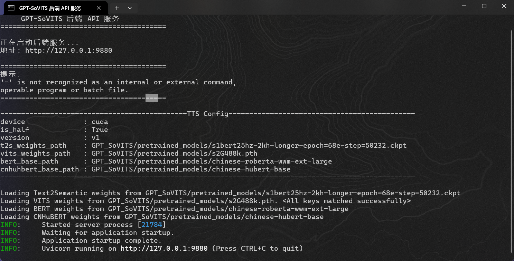
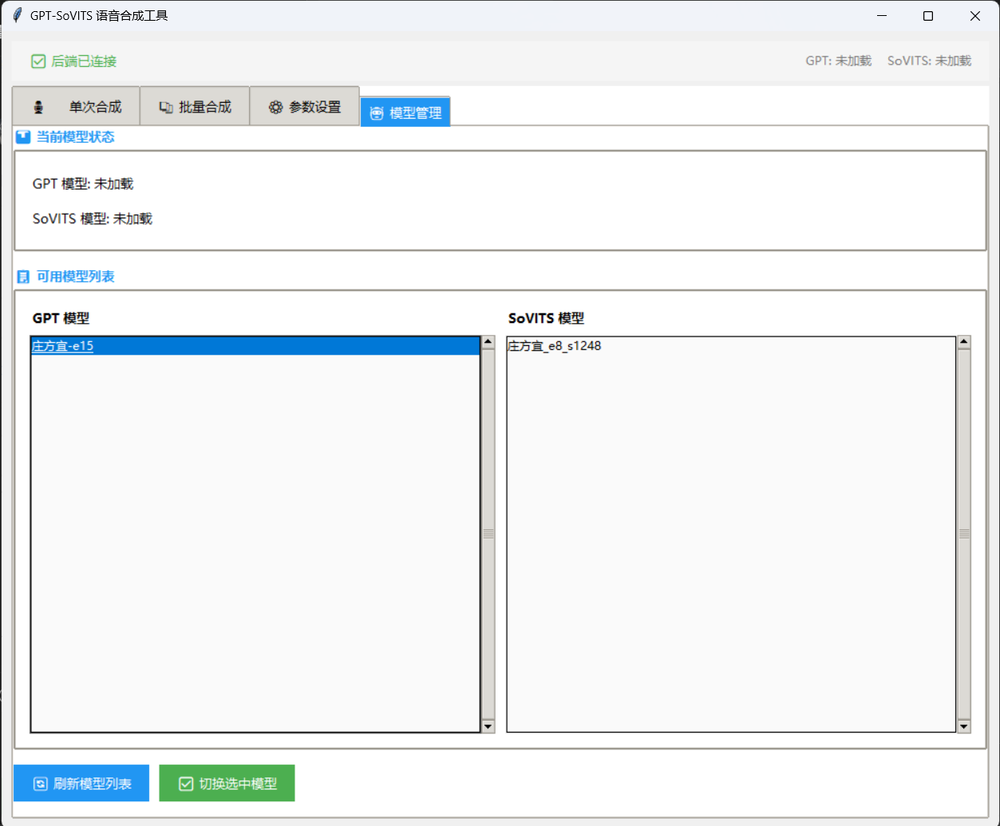
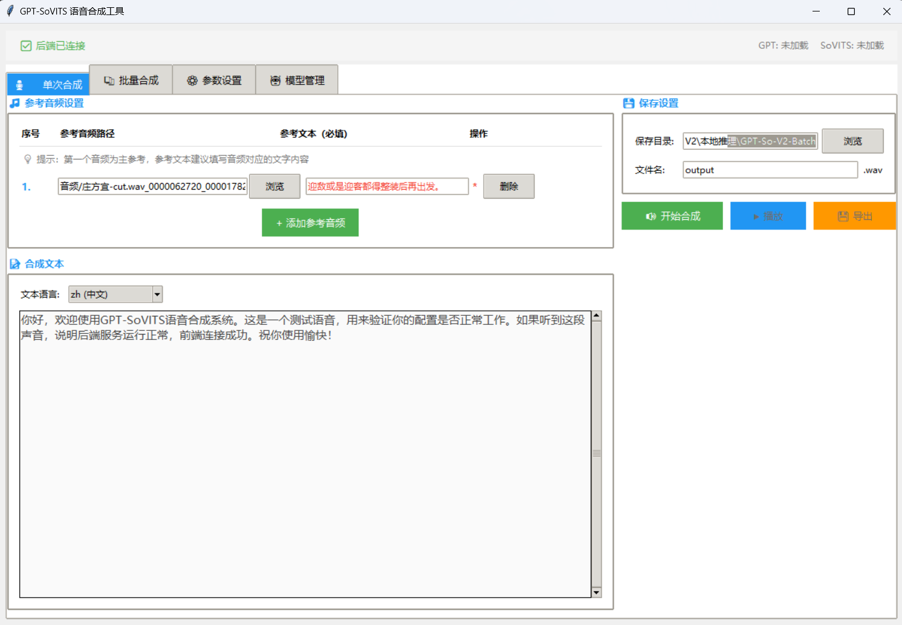
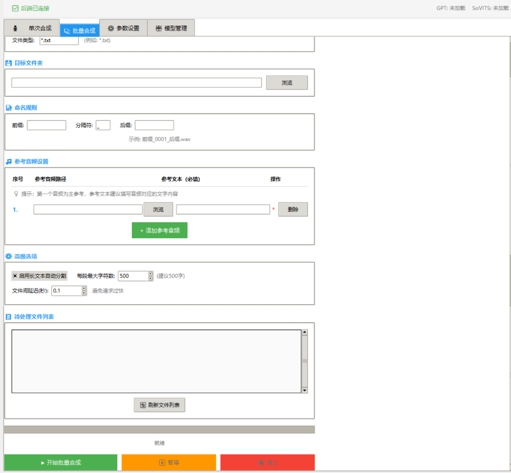

# 🎤 GPT-SoVITS 批量生成语音脚本

> 替换关键文件，启用批量语音合成功能

---

## ⚠️ 使用前必读

- 📌 **模型文件放置规则**：
  - `.ckpt` 后缀文件 → 放入 `GPT_weights_v2/` 文件夹
  - `.pth` 后缀文件 → 放入 `SoVITS_weights_v2/` 文件夹
- 🇯🇵 **日语合成特别提醒**：参考音频必须为日语，文本也必须是日语，英语同理
- 📁 批量合成前建议提前新建好输入/输出文件夹，防止搞混
- 💡 批量合成前先用「单次合成」测试效果

---

##  使用方法

### 1. 下载 GPT-SoVITS-v2pro 整合包或源码

首先确保你已经有 GPT-SoVITS 的运行环境。

### 2. 替换关键文件

1. 进入根目录
2. 将本仓库**所有文件**粘贴进去
3. 选择**替换** `api_v2.py`（建议提前备份）

>根目录/  
├── api_v2.py ← 会被替换（关键文件）  
├── 启动后端.bat  
├── 启动前端.bat   
├── 启动小说剪切.bat  
├── GPT_weights_v2/ ← 放 .ckpt 模型  
├── SoVITS_weights_v2/ ← 放 .pth 模型  
├── output/ ← 生成的语音在这里  
└── （其他文件）  

#### 1. 启动后端

双击 `启动后端.bat`，等待黑窗口显示 `Application startup complete`  

#### 2. 启动前端

双击 `启动前端.bat`，打开 Web 界面进行操作  

#### 3. 单次合成（测试用）

#### 4. 批量合成

切换到「批量合成」标签页，设置输入输出文件夹后点击开始生成  

---

## 📂 建议的工作目录
>E:\novel  
├── 原文本/  
│ └── ****.txt  
├── 切分后文本/  
│ ├── 0001.txt  
│ ├── 0002.txt  
│ └── ...  
└── 生成语音/ ← 最终生成的音频  
├── 0001.wav  
├── 0002.wav  
└── ...  

---

## 📋 目录对照表

| 目录 | 作用 | 存放内容 |
|------|------|----------|
| `原文本/` | 原始素材 | 要处理的小说 txt 文件 |
| `切分后文本/` | 中间产物 | 切分后的小文件（自动编号） |
| `生成语音/` | 最终成果 | 生成的音频 wav 文件 |
| `GPT_weights_v2/` | GPT模型 | `.ckpt` 后缀文件 |
| `SoVITS_weights_v2/` | 声码器模型 | `.pth` 后缀文件 |
| `output/` | 默认输出 | 单次合成的音频 |

---

## 🖼️ 操作流程

### 单次合成（测试用）
1. 选择 GPT 模型和 SoVITS 模型
2. 上传参考音频（建议 5-15 秒，背景干净）
3. 填写参考文本（与音频内容一致）
4. 输入要合成的目标文本
5. 点击「合成语音」

### 批量合成
1. 切换到「批量合成」标签页
2. 输入文件夹：选择 `切分后文本/`
3. 输出文件夹：选择 `生成语音/`
4. 选择参考音频和填写参考文本
5. 点击「开始批量生成」

---

## ❓ 常见问题

| 问题 | 解决方法 |
|------|----------|
| 双击 bat 文件闪退 | 检查文件夹路径是否包含中文，改成英文路径 |
| 前端显示「连接失败」 | 后端还没启动好，等黑窗口显示 `Application startup complete` 后再打开前端 |
| 提示端口 9880 被占用 | 重启电脑，或关闭占用端口的程序 |
| 找不到模型文件 | 检查 `.ckpt` 是否在 `GPT_weights_v2/`，`.pth` 是否在 `SoVITS_weights_v2/` |
| 生成语音很慢 | 正常现象，取决于电脑配置。CPU 模式较慢，GPU 模式较快 |
| 日语合成效果差 | 确保参考音频是日语，文本也是日语，两者语言必须一致 |
| 批量合成中断 | 可以接着上次的编号继续生成 |
| 停止按钮没用 | 已经预输入的文本会自动生成，可以关闭后端命令页面强制取消生成 |

---

## 💡 温馨提示

- 参考音频建议 5-15 秒，背景音干净效果更好
- 模型文件不要随意移动或改名
- 如果生成中断，可以接着上次的编号继续
- 批量合成前先用「单次合成」测试效果

---

## 🙏 致谢

本项目基于 **花儿不哭** 大佬的 **GPT-SoVITS** 项目进行精简和二次开发。

- 原项目地址：[https://github.com/RVC-Boss/GPT-SoVITS](https://github.com/RVC-Boss/GPT-SoVITS)
---

本工具仅供 **学习交流、个人使用、二次创作** 之用。

- 严禁用于任何商业用途
- 严禁用于任何违法违规内容创作，后果自负

---